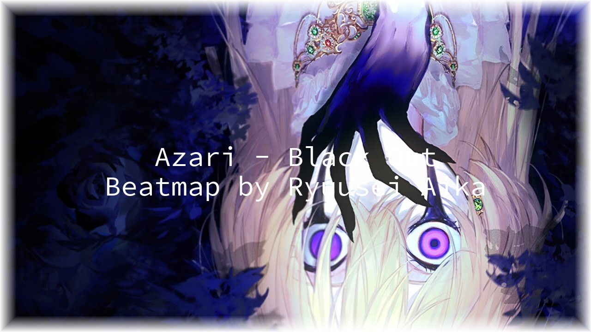

# BeatmapBannerMakerCLI
[](https://github.com/ZyMa-1/BeatmapBannerMakerCLI/releases/latest) 
<br>
<br>
[](https://www.python.org/downloads/release/python-310/)
[](/LICENCE)


CLI script dedicated to manipulating image using `Pillow` library.
Generate beatmap banner by enhancing background file with a border and a text.

## Simple Usage

```bash
python main.py "path_to_your_osu!_folder\Songs\1965625 Azari - Black Out\Azari - Black Out (Ryuusei Aika) [----].osu" --output res/result2.png
```

Resulted image would look like that:



It is not the best quality cause I'm not a designer of any sort.

Under curtains, my script loads `default-style.yaml` file which looks like that:

```yaml
####################
#
# border-thickness: {int number}px        |  Thickness in pixels
# border-thickness: {float number}%       |  Border thickness in pixels relative to min(width, height)
#
# border-color: {string}                  |  Name of the color: "black", "white", etc.
# border-color: {0-255},{0-255},{0-255}   |  RGB color
#
# font-size: {int number}px               |  Font size in pixels
# font-size: {float number}%              |  Font size in pixels relative to min(width, height)
#
# crop-vertical-size: {int number}px      |  Crop image from the top and the bottom by a given amount of pixels
# crop-vertical-size: {float number}%     |  Crop image from the top and the bottom by a given amount of pixels
#                                         |                                       relative to min(width, height)
#
# font-color: {string}                    |  Name of the color: "black", "white", etc.
# font-color: {0-255},{0-255},{0-255}     |  RGB color
#
# font-family: {string}                   |  Path to the 'ttf' font file
# font-family: default                    |  'data/fonts/SourceCodePro-Regular.ttf'
#
# text: YAML list of python f-strings     |
# text: default                           |  ["{artist} - {title}", "Beatmap by {creator}"]
#
# Available f-strings: ('title', 'title_unicode', 'artist', 'artist_unicode',
#                       'creator', 'source', 'beatmap_id', 'beatmap_set_id')
#
#                       I.e.  Some metadata
#
###################
$schema: ../yaml_schemas/yaml_schema.json # Just specifying a schema, not necessary
parameters:
  border-thickness: 5%
  border-color: white
  font-size: 60px
  crop-vertical-size: 15%
  font-color: white
  font-family: default
  text: default
```

You can specify some parameters there and further pass `your_style.yaml` path to the script using `--style` or `-s` parameter.  
  
Also as you may notice in the default `yaml` file is some sort of documentation, you can refer to it when changing parameters.
